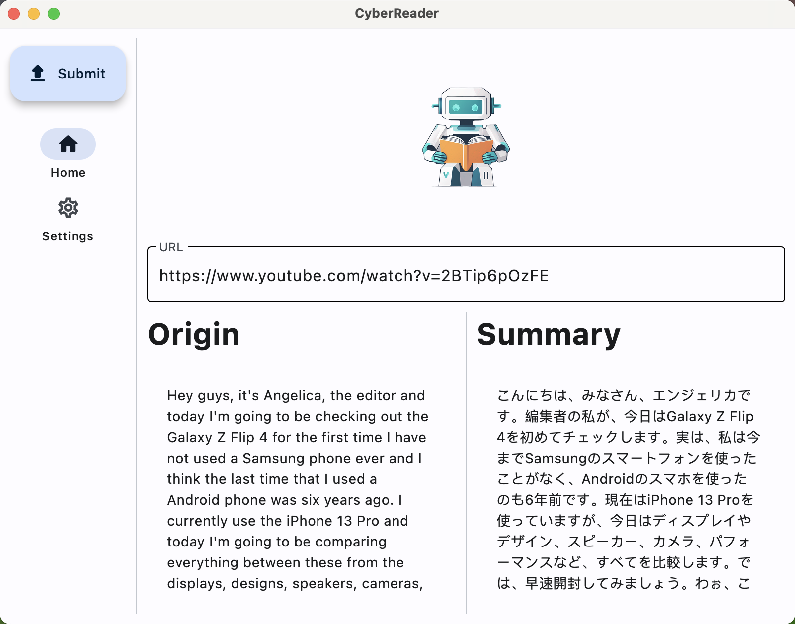
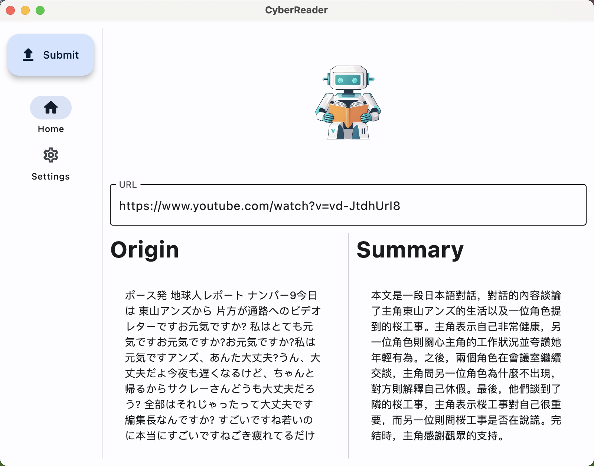
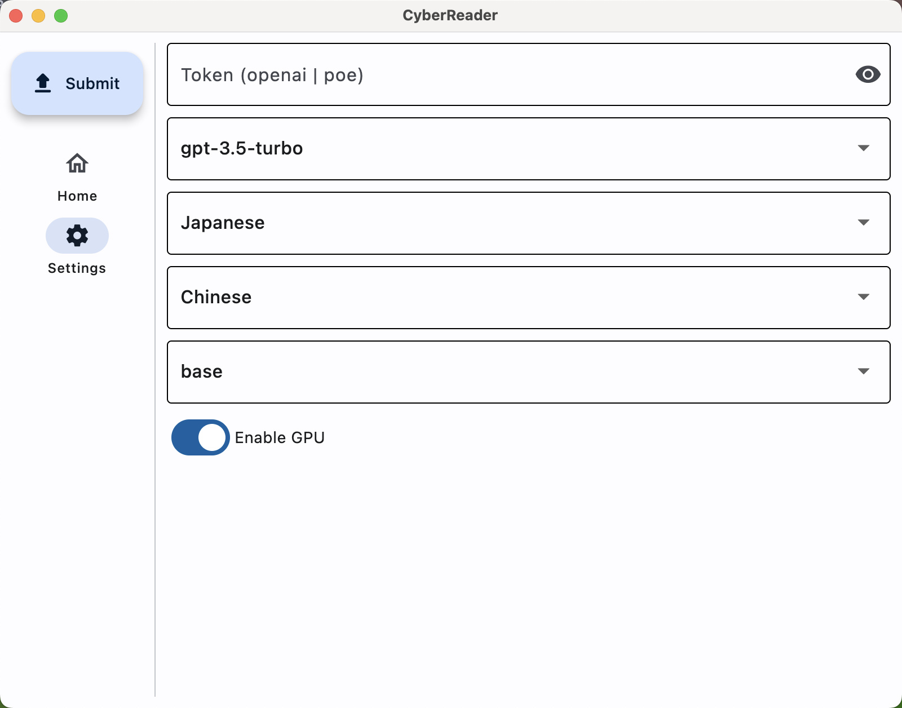

# 🚀CyberReader 🤖📖🎬🎧

<p align="center">
  
</p>

Welcome to CyberReader, your personal cyber assistant designed to boost your productivity! Unleash the power of Large Language Models (LLMs) to read and comprehend virtually anything! 📖📚🎧

## 📝 Supported Inputs

Done: ✅
Todo: ❓

### 🎥 Media (Video & Audio)

|                  | YouTube | Bilibili | Bare URL | M3u8 URL | FilePath | ...  |
| ---------------- | ------- | -------- | -------- | -------- | -------- | ---- |
| Support Schedule | ✅       | ✅        | ✅        | ✅        | ✅        | ...  |
| Tested           | ✅       | ✅        | ✅        | ✅        | ✅        | ...  |

### 📄 Documents

|                  | PDF  | Word | HTML | eBook |
| ---------------- | ---- | ---- | ---- | ----- |
| Support Schedule | ❓    | ❓    | ❓    | ❓     |
| Tested           | ❓    | ❓    | ❓    | ❓     |

## 🔧 Requirements

Conda (Recommended):

```bash
conda create -n cyberreader python=3.10
conda activate cyberreader
pip install -r requirements.txt
```

Pip:

```bash
pip install -r requirements.txt
```

## 💻 Usage

```bash
python main.py
```

### ⌨️Input

Enter the URL or File Path, which is the path of the media or document you want to read. Supported inputs are listed above.

### 🛠️ Config

```bash
mv config.yaml.template config.yaml
```

#### 🤫Token

TODO: Implement multi-token storage

**Supported Tokens**

|                  | OpenAI | POE  | Claude | Baidu |
| ---------------- | ------ | ---- | ------ | ----- |
| Support Schedule | ✅      | ✅    | ❓      | ❓     |
| Tested           | ✅      | ❌    | ❓      | ❓     |

Fill the Token in the `config.yaml` (recommended) or enter the token in the GUI.

#### 🤖LLMs Model

The API provider will be identified based on the model name.

#### ⚙️WhisperModel (only for media)

Change the whisper model used. Generally, the larger the model, the more accurate the recognition, but it will also be more time-consuming.

#### ⏩Enable GPU (only for media)

Supports using GPU to accelerate whisper model inference.

#### 💬InputLanguage (optional & only for media)

If this parameter is ignored, the language will be automatically detected. For higher recognition accuracy, users can specify the source language in advance.

#### ✍️OutputLanguage

The desired output language of the user, this parameter will be applied to the prompt to change the final output language.

### 📁 Middle Results

Media file: `tmp`

Original text: `result/${timestamp}/original.txt`

Result text: `result/${timestamp}/result.txt`

## 🎥 Demo

### Summarize YouTube Video

**English Video -> English Text -> Japanese Summary**




**Japanese Video -> Japanese Text -> Chinese Summary**





## 📝 License

MIT License

## ❓ Q&A

### Why create this project?

Many of my courses require watching a large number of videos for pre-class preparation and completing assignments based on the video content. However, watching videos is often inefficient, and the contents are not easily retained. Therefore, we hope that this project can enhance the efficiency of watching videos and memory retention of the content, significantly improving the efficiency of information retrieval when doing assignments.

### Will text reading be supported?

Yes, we are planning to support text reading. However, due to academic obligations, we haven't had the time to implement this feature. If you are interested, we welcome you to submit a PR.

### Will dialogue be supported?

Yes, we are planning to support dialogue as well, but it hasn't been implemented yet for the same reasons above.